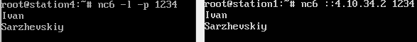
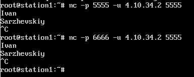
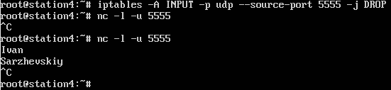
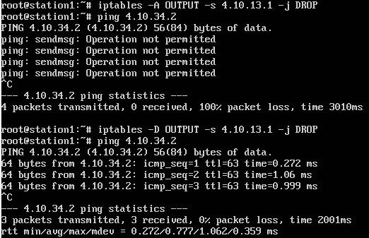
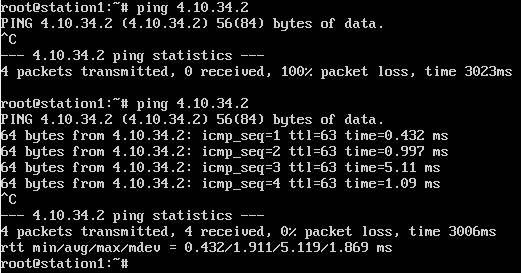
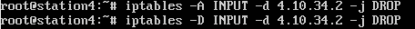
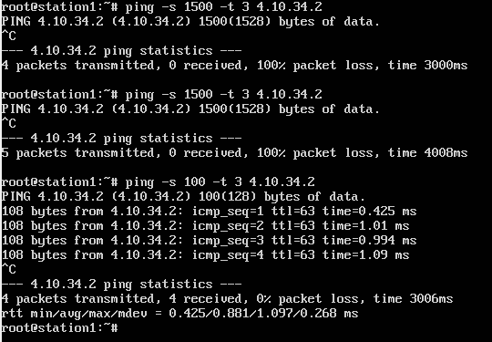
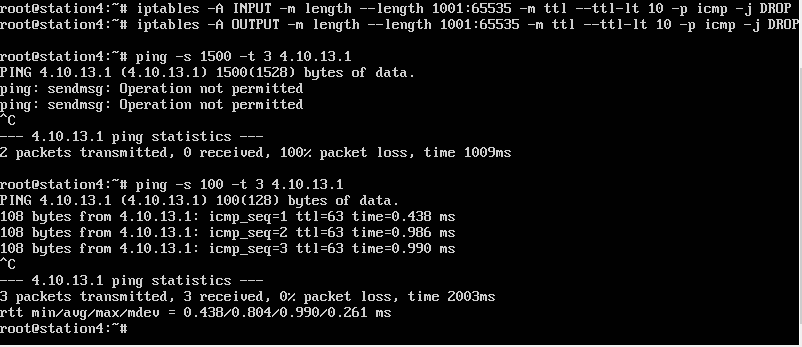

# ЦЕЛЬ
...

# ЗАДАНИЕ
...

# Исходные данные
Имя: **ИВАН**, длина 4

Фамилия: **САРЖЕВСКИЙ**, длина 10

`V_1 = 1 + ((4+10) mod 5) = 5`


_рис 1. Топология сети и схема прохождения трафика для варианта 5_

На рисунке 1 изображена топология сети и требуемый путь прохождения сетевых пакетов. С компьютера 4 посылается ICMP Echo Request на адрес, который не существует в данной сети. На компьютерах 1, 2 и 3 должны быть настроены таблицы маршрутизации и правила NAT таким образом, чтобы пакет поочередно прошел через компьютеры 3, 2, 1 и снова пройдя через компьютер 3 пришел на компьютер 4 (сплошные линии на рисунке 4.4.5) с IP заголовком, в котором IP адрес источника и IP адрес назначения будут поменяны местами. Таким образом, компьютер 4 получит ICMP Echo Request на свой локальный адрес и ответит на него. ICMP Echo Reply должен пройти обратный путь (`4->3->1->2->3->4`) и прийти на компьютер 4 (штриховые линии на рисунке 4.9) с поменяными местами адресами источника и назначения. В результате выполнения команды ping должна быть выведена информация об успешном выполнении. Т.о. компьютер 4 сам отвечает на собственные ICMP запросы, однако пакет проходит через внешнюю сеть маршрутизаторов

# Выбор IPv4 и IPv6 адресов

`4.10.X.Y/M`:

Подсеть `s1_s3`:
* **s1:** `4.10.13.1/30  --  ::4.10.13.1/126`
* **s3:** `4.10.13.2/30  --  ::4.10.13.2/126`

Подсеть `s1_s2`:
* **s1:** `4.10.12.1/30  --  ::4.10.12.1/126`
* **s2:** `4.10.12.2/30  --  ::4.10.12.2/126`

Подсеть `s2_s3`:
* **s2:** `4.10.23.1/30  --  ::4.10.23.1/126`
* **s3:** `4.10.23.2/30  --  ::4.10.23.2/126`

Подсеть `s3_s4`:
* **s3:** `4.10.34.1/30  --  ::4.10.34.1/126`
* **s4:** `4.10.34.2/30  --  ::4.10.34.2/126`

# Настройка сети

## station_1
```
ip link set eth2 up                           # включаем s1_s3
ip a add 4.10.13.1/30 dev eth2                # ipv4 s1_s3
ip -6 a add ::4.10.13.1/126 dev eth2          # ipv6 s1_s3

ip link set eth1 up                           # включаем s1_s2
ip a add 4.10.12.1/30 dev eth1                # ipv4 s1_s2
ip -6 a add ::4.10.12.1/126 dev eth1          # ipv6 s1_s2
```

## station_2
```
ip link set eth1 up                           # включаем s1_s2
ip a add 4.10.12.2/30 dev eth1                # ipv4 s1_s2
ip -6 a add ::4.10.12.2/126 dev eth1          # ipv6 s1_s2

ip link set eth2 up                           # включаем s2_s3
ip a add 4.10.23.1/30 dev eth2                # ipv4 s2_s3
ip -6 a add ::4.10.23.1/126 dev eth2          # ipv6 s2_s3
```

## station_3
```
ip link set eth1 up                           # включаем s1_s3
ip a add 4.10.13.2/30 dev eth1                # ipv4 s1_s3
ip -6 a add ::4.10.13.2/126 dev eth1          # ipv6 s1_s3

ip link set eth2 up                           # включаем s3_s4
ip a add 4.10.34.1/30 dev eth2                # ipv4 s3_s4
ip -6 a add ::4.10.34.1/126 dev eth2          # ipv6 s3_s4

ip link set eth3 up                           # включаем s2_s3
ip a add 4.10.23.2/30 dev eth3                # ipv4 s2_s3
ip -6 a add ::4.10.23.2/126 dev eth3          # ipv6 s2_s3
```

## station_4
```
ip link set eth1 up                           # включаем s3_s4
ip a add 4.10.34.2/30 dev eth1                # ipv4 s3_s4
ip -6 a add ::4.10.34.2/126 dev eth1          # ipv6 s3_s4
```

## station_3
```
sysctl -w net.ipv4.ip_forward=1           # включаем ip_forward
sysctl -w "net.ipv4.conf.all.rp_filter=0" # отключаем фильтр пакетов, где
                                          # dest недостижим из текущего интерфейса
# включаем forwarding для ipv6
echo "net.ipv6.conf.all.forwarding=1" >> /etc/sysctl.conf
sysctl -p /etc/sysctl.conf
```

## station_1
```
# добавляем роут 1->(3)->4
ip ro add 4.10.34.2 via 4.10.13.2
ip -6 ro a ::4.10.34.2/126 via ::4.10.13.2

apt-get install netcat6
```

## station_2
```
# добавляем роут 2->(3)->4
ip ro add 4.10.34.2 via 4.10.23.2
ip -6 ro a ::4.10.34.2/126 via ::4.10.23.2
```

## station_4
```
# добавляем роут 4->(3)->1
ip ro add 4.10.13.1 via 4.10.34.1
ip -6 ro a ::4.10.13.1/126 via ::4.10.34.1

# добавляем роут 4->(3)->2
ip ro add 4.10.23.2 via 4.10.34.1
ip -6 ro a ::4.10.23.2/126 via ::4.10.34.1

apt-get install netcat6
```

## Проверка

Проверим настройку сети с помощью утилиты `nc`, в роли клиента будет
компьтер 4, а сервера - компьютер 1.


_рис. 2 Результат выполнения команды `nc`, ipv4_



_рис. 2 Результат выполнения команды `nc`, ipv6_

## Реализация простого Firewall'а

1. Запретить передачу только тех пакетов, которые отправлены на `TCP`-порт,
заданный в настройках утилиты `nc`.

```
iptables -A OUTPUT -p tcp --destination-port 5555 -j DROP
```


_рис. 3 firewall первое правило, source_


_рис. 4 firewall первое правило, destination_

2. Запретить приём только тех пакетов, которые отправлены с `UDP`-порта утилиты `nc`.

```
iptables -A INPUT -p tcp --source-port 5555 -j DROP
```



_рис. 5 firewall второе правило, source_



_рис. 6 firewall второе правило, destination_

3. Запретить передачу только тех пакетов, которые отправлены с `IP`-адреса компьютера А.

```
iptables -A OUTPUT -s 4.10.13.1 -j DROP
```



_рис. 7 firewall третье правило, source_

4. Запретить  приём  только  техпакетов,  которые  отправлены  на  `IP`-адрес компьютера Б.

```
iptables -A INPUT -d 4.10.34.2 -j DROP
```



_рис. 8 firewall четвертое правило, source_



_рис. 9 firewall четвертое правило, destination_

5. Запретить  приём  и  передачу `ICMP`-пакетов,  размер  которых превышает 1000 байт, а поле
`TTL` при этом меньше 10.

```
iptables -A INPUT -m ttl --ttl-lt 10 -m length --length 1001:65535 -p icmp -j DROP
iptables -A OUTPUT -m ttl --ttl-lt 10 -m length --length 1001:65535 -p icmp -j DROP
```



_рис. 10 firewall пятое правило, source_



_рис. 11 firewall пятое правило, destination_

# Вариативная часть
Пусть несуществующий ip - `4.10.44.4/30`.

## station_4

```
ip link set eth1 up                           # включаем s3_s4
ip a add 4.10.34.2/30 dev eth1                # ipv4 s3_s4

ip ro add 4.10.44.4 via 4.10.31.1             # роут 4->(3)->\X\
```

## station_3

```
ip link set eth1 up                           # включаем s1_s3
ip link set eth2 up                           # включаем s3_s4
ip link set eth3 up                           # включаем s2_s3

ip a add 4.10.13.2/30 dev eth1                # ipv4 s1_s3
ip a add 4.10.34.1/30 dev eth2                # ipv4 s3_s4
ip a add 4.10.23.2/30 dev eth3                # ipv4 s2_s3

# 0xbada55 путь ping
iptables -t mangle -A PREROUTING -p icmp --icmp-type ping -s 4.10.34.2 -j MARK --set-mark 0xbada55
ip ro add table 666 4.10.34.2 via 4.10.13.1 dev eth1
ip rule add fwmark 0xbada55 table 666

# deadd00d путь pong
iptables -t mangle -A PREROUTING -p icmp --icmp-type pong -s 4.10.34.2 -j MARK --set-mark 0xdeadd00d
ip ro add table 999 4.10.34.2 via 4.10.23.2 dev eth3
ip rule add fwmark 0xdeadd00d table 999


# меняем местами source и destination
iptables -t nat -A PREROUTING -p icmp -s 4.10.34.2 -d 4.10.44.4 -j DNAT --to 4.10.34.2
iptables -t nat -A POSTROUTING -p icmp -s 4.10.34.2 -d 4.10.34.2 -j SNAT --to 4.10.44.4

# перенаправляем ping на station_4
iptables -t mangle -A PREROUTING -p icmp --icmp-type ping -s 4.10.44.4 -j TEE --gateway 4.10.34.2

sysctl -w net.ipv4.ip_forward=1           # включаем ip_forward
sysctl -w "net.ipv4.conf.all.rp_filter=0" # отключаем фильтр пакетов, где
                                          # dest недостижим из текущего интерфейсаa
```

## station_1

```
ip link set eth2 up                           # включаем s1_s3
ip link set eth1 up                           # включаем s1_s2

ip a add 4.10.13.1/30 dev eth2                # ipv4 s1_s3
ip a add 4.10.12.1/30 dev eth1                # ipv4 s1_s2

# перенаправляем ping на station_2
iptables -t mangle -A PREROUTING -p icmp --icmp-type ping -s 4.10.44.4 -j TEE --gateway 4.10.12.2
```

## station_2

```
ip link set eth1 up                           # включаем s1_s2
ip link set eth2 up                           # включаем s2_s3

ip a add 4.10.12.2/30 dev eth1                # ipv4 s1_s2
ip a add 4.10.23.1/30 dev eth2                # ipv4 s2_s3

# перенаправляем ping на station_3
iptables -t mangle -A PREROUTING -p icmp --icmp-type ping -s 4.10.44.4 -j TEE --gateway 4.10.23.2
# перенаправляем pong на station_1
iptables -t mangle -A PREROUTING -p icmp --icmp-type pong -s 4.10.44.4 -j TEE --gateway 4.10.12.1
```