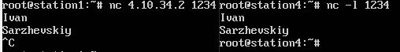

## ЦЕЛЬ
...

## ЗАДАНИЕ
...

## Исходные данные
Имя: **ИВАН**, длина 4

Фамилия: **САРЖЕВСКИЙ**, длина 10

`V_1 = 1 + ((4+10) mod 5) = 5`


_рис 1. Топология сети и схема прохождения трафика для варианта 5_

На рисунке 1 изображена топология сети и требуемый путь прохождения сетевых пакетов. С компьютера 4 посылается ICMP Echo Request на адрес, который не существует в данной сети. На компьютерах 1, 2 и 3 должны быть настроены таблицы маршрутизации и правила NAT таким образом, чтобы пакет поочередно прошел через компьютеры 3, 2, 1 и снова пройдя через компьютер 3 пришел на компьютер 4 (сплошные линии на рисунке 4.4.5) с IP заголовком, в котором IP адрес источника и IP адрес назначения будут поменяны местами. Таким образом, компьютер 4 получит ICMP Echo Request на свой локальный адрес и ответит на него. ICMP Echo Reply должен пройти обратный путь (`4->3->1->2->3->4`) и прийти на компьютер 4 (штриховые линии на рисунке 4.9) с поменяными местами адресами источника и назначения. В результате выполнения команды ping должна быть выведена информация об успешном выполнении. Т.о. компьютер 4 сам отвечает на собственные ICMP запросы, однако пакет проходит через внешнюю сеть маршрутизаторов

## Выбор IPv4 и IPv6 адресов

`4.10.X.Y/M`:

Подсеть `s1_s3`:
* **s1:** `4.10.13.1/30  --  ::ffff:40a:d01/126`
* **s3:** `4.10.13.2/30  --  ::ffff:40a:d02/126`

Подсеть `s1_s2`:
* **s1:** `4.10.12.1/30  --  ::ffff:40a:c01/126`
* **s2:** `4.10.12.2/30  --  ::ffff:40a:c02/126`

Подсеть `s2_s3`:
* **s2:** `4.10.23.1/30  --  ::ffff:40a:1701/126`
* **s3:** `4.10.23.2/30  --  ::ffff:40a:1702/126`

Подсеть `s3_s4`:
* **s3:** `4.10.34.1/30  --  ::ffff:40a:2201/126`
* **s4:** `4.10.34.2/30  --  ::ffff:40a:2202/126`

## Настройка сети

### station_1
```
ip link set eth2 up                       # включаем s1_s3
ip a add 4.10.13.1/30 dev eth2            # ipv4 s1_s3
ip -6 a add ::ffff:40a:d01/127 dev eth2   # ipv6 s1_s3

ip link set eth1 up                       # включаем s1_s2
ip a add 4.10.12.1/30 dev eth1            # ipv4 s1_s2
ip -6 a add ::ffff:40a:c01/127 dev eth1   # ipv6 s1_s2
```

### station_2
```
ip link set eth1 up                       # включаем s1_s2
ip a add 4.10.12.2/30 dev eth1            # ipv4 s1_s2
ip -6 a add ::ffff:40a:c02/126 dev eth1   # ipv6 s1_s2

ip link set eth2 up                       # включаем s2_s3
ip a add 4.10.23.1/30 dev eth2            # ipv4 s2_s3
ip -6 a add ::ffff:40a:1701/126 dev eth2  # ipv6 s2_s3
```

### station_3
```
ip link set eth1 up                       # включаем s1_s3
ip a add 4.10.13.2/30 dev eth1            # ipv4 s1_s3
ip -6 a add ::ffff:40a:d02/126 dev eth1   # ipv6 s1_s3

ip link set eth2 up                       # включаем s3_s4
ip a add 4.10.34.1/30 dev eth2            # ipv4 s3_s4
ip -6 a add ::ffff:40a:2201/126 dev eth2  # ipv6 s3_s4

ip link set eth3 up                       # включаем s2_s3
ip a add 4.10.23.2/30 dev eth3            # ipv4 s2_s3
ip -6 a add ::ffff:40a:1702/126 dev eth3  # ipv6 s2_s3
```

### station_4
```
ip link set eth1 up                       # включаем s3_s4
ip a add 4.10.34.2/30 dev eth1            # ipv4 s3_s4
ip -6 a add ::ffff:40a:2202/126 dev eth1  # ipv6 s3_s4
```

### station_3
```
sysctl -w net.ipv4.ip_forward=1           # включаем ip_forward
sysctl -w "net.ipv4.conf.all.rp_filter=0" # отключаем фильтр пакетов, где
                                          # dest недостижим из текущего интерфейса
```

### station_1
```
ip ro add 4.10.34.2 via 4.10.13.2         # добавляем роут 1->(3)->4
```

### station_2
```
ip ro add 4.10.34.2 via 4.10.23.2         # добавляем роут 2->(3)->4
```

### station_4
```
ip ro add 4.10.13.1 via 4.10.34.1         # добавляем роут 4->(3)->1
ip ro add 4.10.23.2 via 4.10.34.1         # добавляем роут 4->(3)->2
```

### Проверка

Проверим настройку сети с помощью утилиты `nc`, в роли клиента будет
компьтер 4, а сервера - компьютер 1.



_рис. 2 Результат выполнения команды `nc`_

## Реализация простого Firewall'а

1. Запретить передачу только тех пакетов, которые отправлены на `TCP`-порт,
заданный в настройках утилиты `nc`.

```
iptables -A OUTPUT -p tcp --destination-port 5555 -j DROP
```


_рис. 3 firewall первое правило, source_


_рис. 4 firewall первое правило, destination_